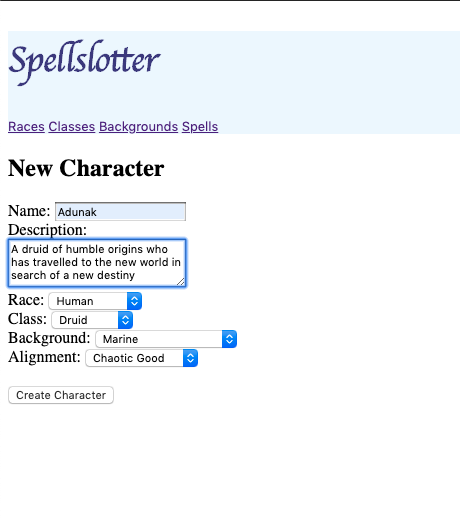
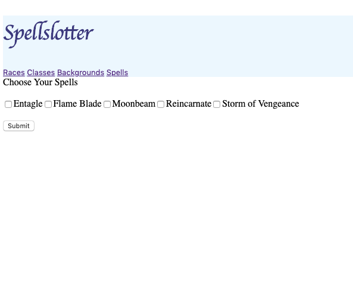
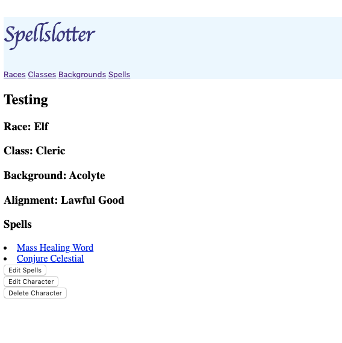

# Spellslotter

### Features
* Track the spells for your D&D Spellcasters!
* Create new characters!
* It's dangerous to go only. Join a party! 

### Install
* Clone this repo
* run ```bundle install```
* run ```rails s```

### Usage
* To register as a player, visit http://localhost:3000/players/new
* Create a new character from the link in your player page
* If your player is a preparation spellcaster, choose or edit your spells from your character page
  * Clerics, Druids, Paladins, and Wizards will have this option
* Join a party by visiting http://localhost:3000/parties or create your own at http://localhost:3000/parties/new
* Veiw a list of available races, classes, backgrounds, and spells from the navbar at anytime

### Screenshots






#### Credits
Dungeons & Dragons, and all affiliated information, is owned and trademarked by of Wizards of the Coast.

#### License [MIT](https://en.wikipedia.org/wiki/MIT_License)

Copyright (C) 2020 Christopher Wagstaffe

Permission is hereby granted, free of charge, to any person obtaining a copy
of this software and associated documentation files (the "Software"), to deal
in the Software without restriction, including without limitation the rights
to use, copy, modify, merge, publish, distribute, sublicense, and/or sell
copies of the Software, and to permit persons to whom the Software is
furnished to do so, subject to the following conditions:

The above copyright notice and this permission notice shall be included in all
copies or substantial portions of the Software.

THE SOFTWARE IS PROVIDED "AS IS", WITHOUT WARRANTY OF ANY KIND, EXPRESS OR
IMPLIED, INCLUDING BUT NOT LIMITED TO THE WARRANTIES OF MERCHANTABILITY,
FITNESS FOR A PARTICULAR PURPOSE AND NONINFRINGEMENT. IN NO EVENT SHALL THE
AUTHORS OR COPYRIGHT HOLDERS BE LIABLE FOR ANY CLAIM, DAMAGES OR OTHER
LIABILITY, WHETHER IN AN ACTION OF CONTRACT, TORT OR OTHERWISE, ARISING FROM,
OUT OF OR IN CONNECTION WITH THE SOFTWARE OR THE USE OR OTHER DEALINGS IN THE
SOFTWARE.
